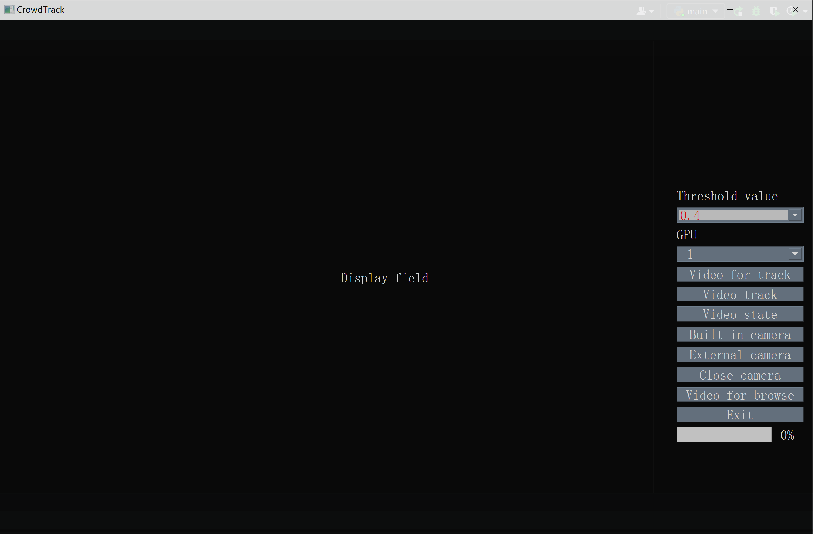

# CrowdTracker-Pytorch(Single Camera)

[简体中文](./README.md) | [English](./README_en.md)

## Address Navigation

+ [→Paddle_edtion_address](https://github.com/ReverseSacle/FairMOT-Paddle-Tracker_Basic)
+ [→Original_author_Github_address](https://github.com/ifzhang/FairMOT)

## Preview

## Preview for Interface

## Enviroment Requirement

+ Python3
+ opencv-python
+ DCNv2
+ Had tested system → window10
+ The provided pkged enviroment(coda enviroment that has all the needed libs)  [→Google Drive](https://drive.google.com/file/d/1cOELR0lXD8oJwzMne0kx_PShylMwclBA/view?usp=sharing)

## Introduction

+ [→Making_Introduction](https://github.com/ReverseSacle/CrowdTracker-Pytorch_Basic/blob/main/docs/Making_Introduction_en.md)

## Provided Model file

+ **Download：** Provided by Original author [→Google Drive](https://drive.google.com/file/d/1PRkK0G5-I9t63cT_YgCetKSpxQEecZ7-/view?usp=sharing)  Need to put it into  the folder named `models` in root dir
+ **Extra missing file：** [→Google Drive](https://drive.google.com/file/d/1sZ0PHOtHkfAHpJ1Na4Ff0SD7NJktFKHq/view?usp=sharing)  Put it into  `C:\Users\User name\.cache\torch\hub\checkpoints`

## Quickly start

+ `git clone "https://github.com/ReverseSacle/CrowdTracker-Pytorch_Basic.git"`
+ Unzip the 7z file of  `CrowdTracker-env` in `./Anaconda3/envs/`
+ Use compiler, like pycharm, where choose the enviroment of CrowdTracker-env on.Then, create a folder named `models` in the root of this project, unzip the beneath mode file into the `models` folder.

## About Construction

+ `PyQt5`     →  the interface,the group of button, the choosing bar of threshold value, the choosing bar of GPU, the function of choosing file and the progress bar
+ `Pytorch`  →  the track system of deep-learning
+ `OpenCV` →  the function of tracking (video/camera), the function of playing video and stoping video

## Update Record

2021.11.29  Create a new brach ByteTrack-kernel，replace original mot kernel with bytetrack

2022.12.12  Simplify the source code of ByteTrack-track-kernel and FairMot-track-kernel, which is divided into the source code of interface, video tracking,built-in camera tracking and external camera tracking.Fix the error of LINK2001 in the provided compiler enviroment.

 
